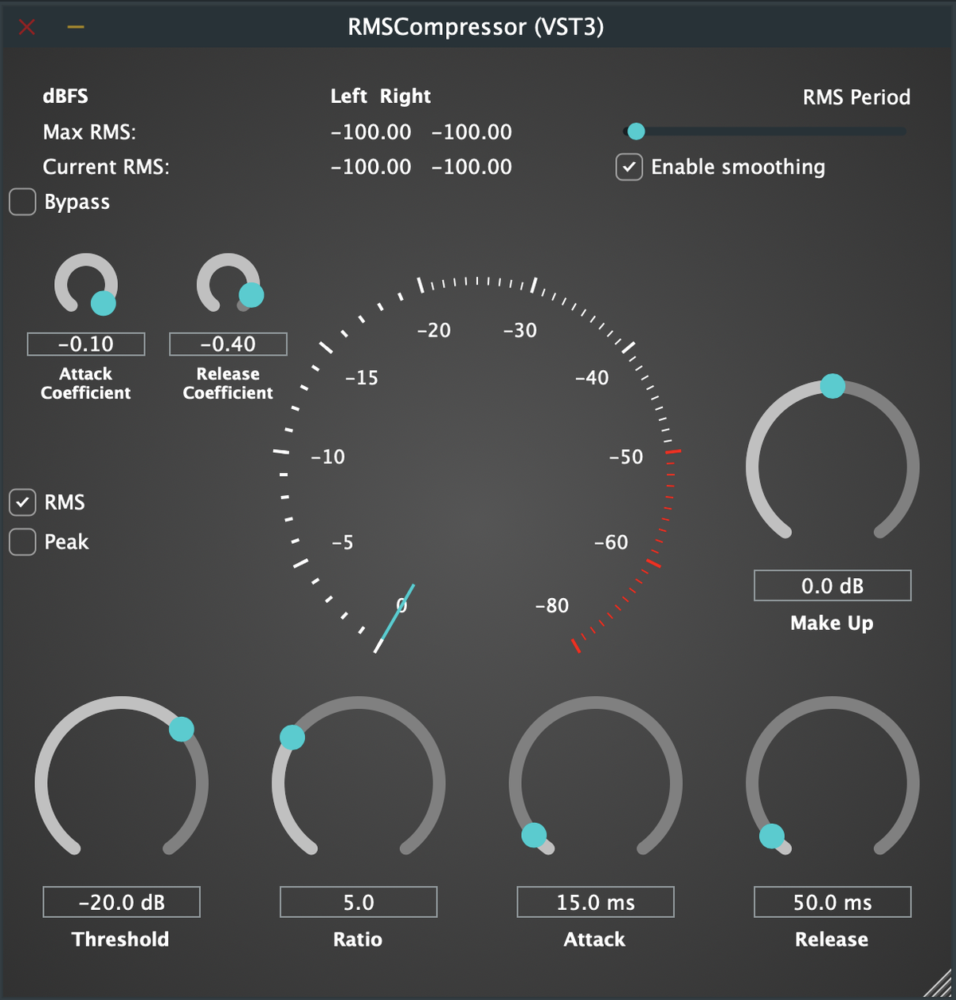
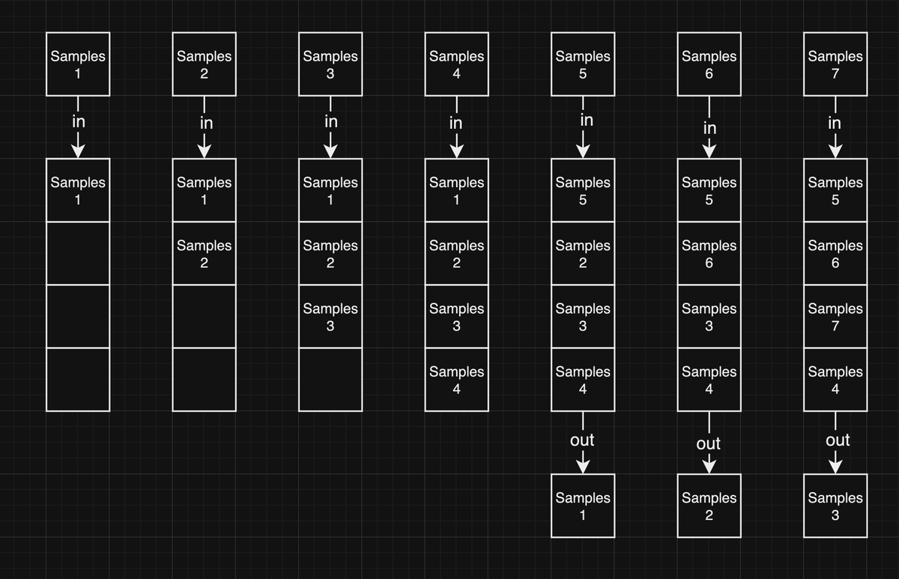
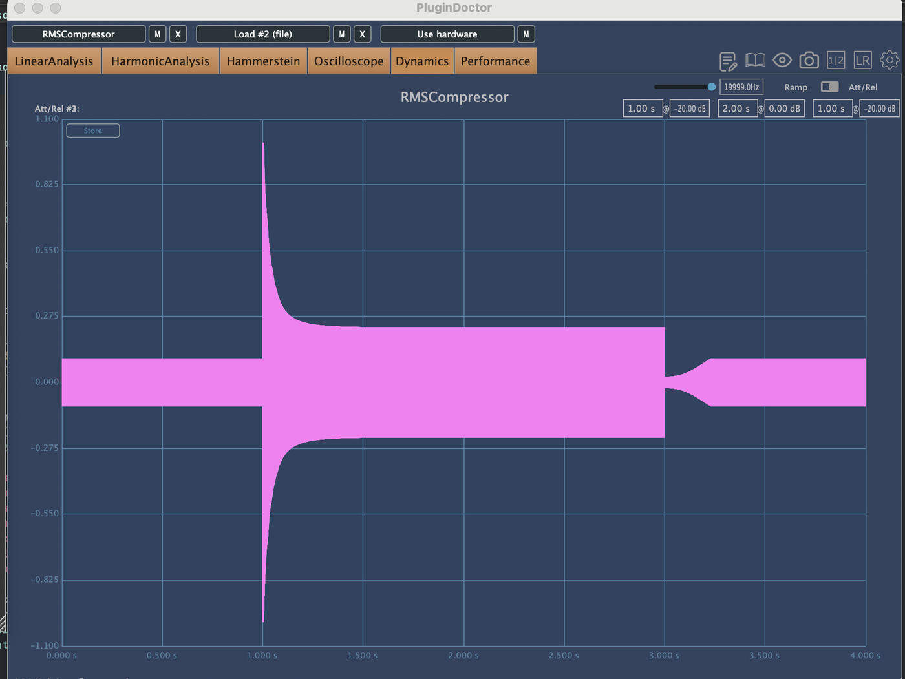
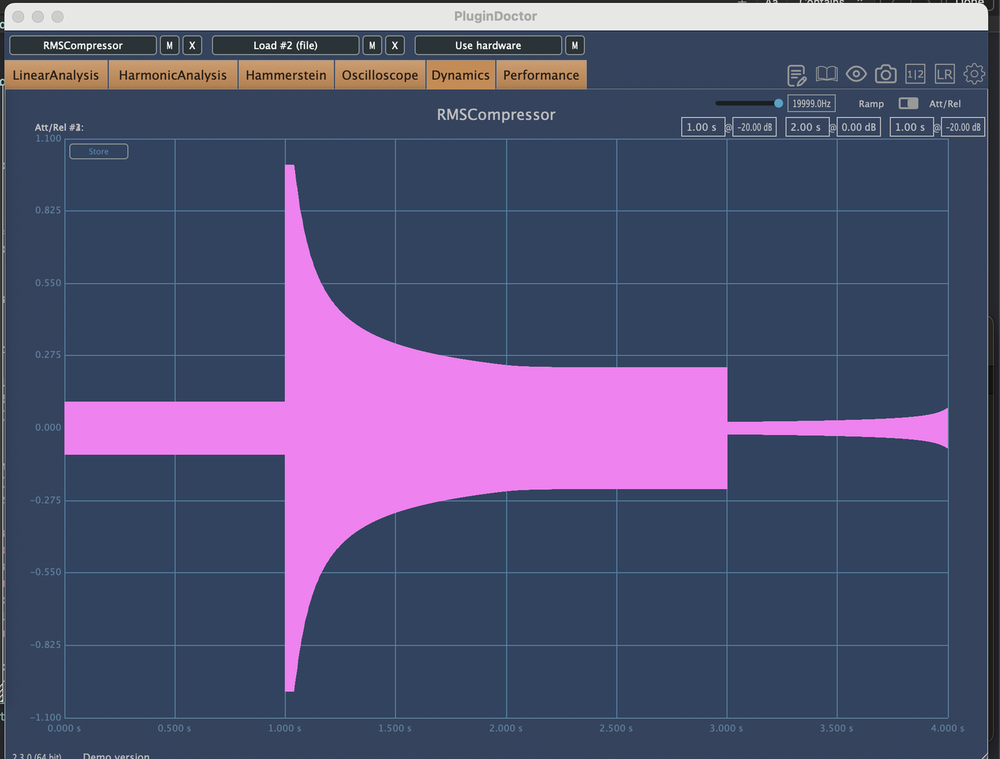
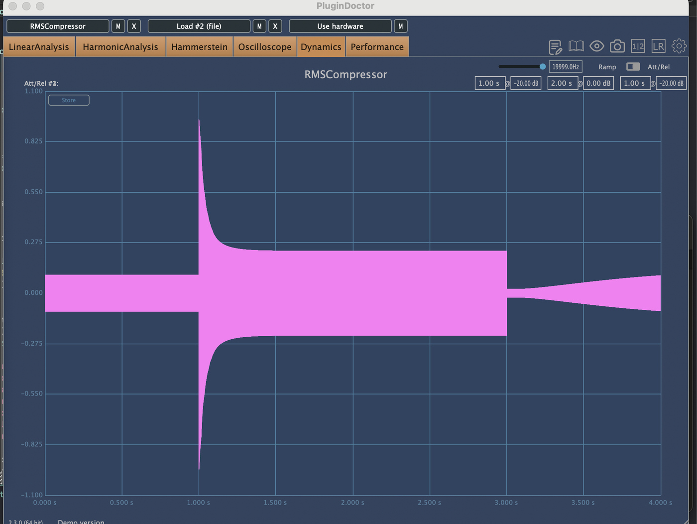
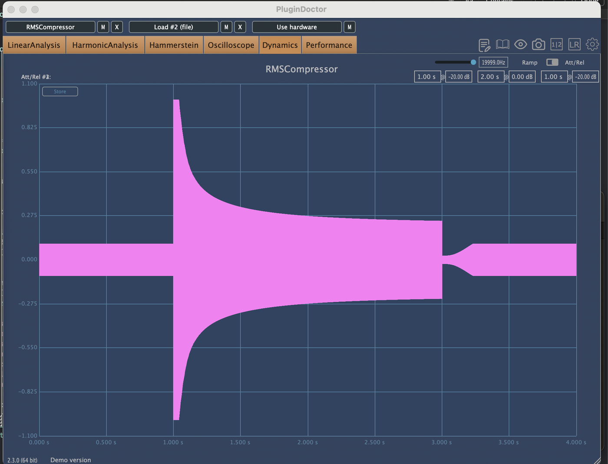
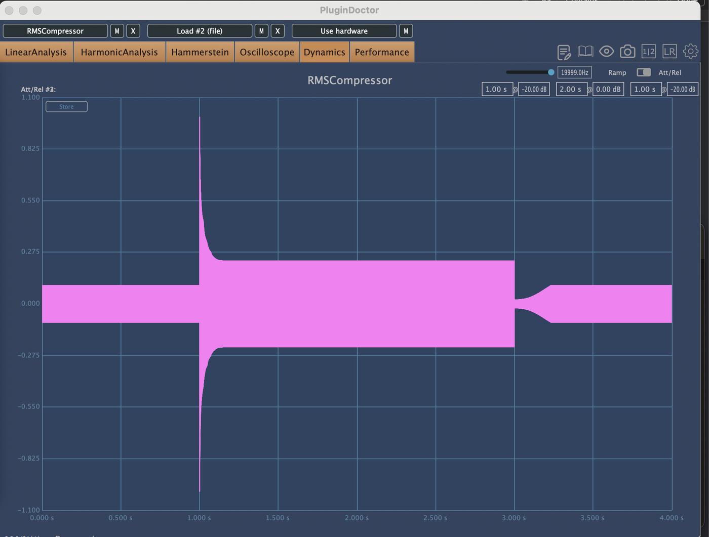
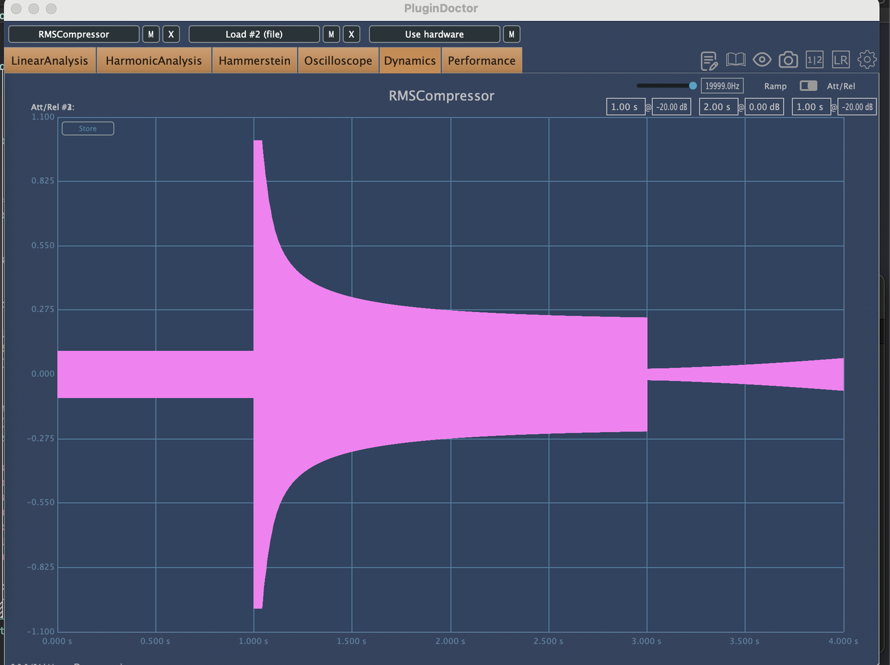
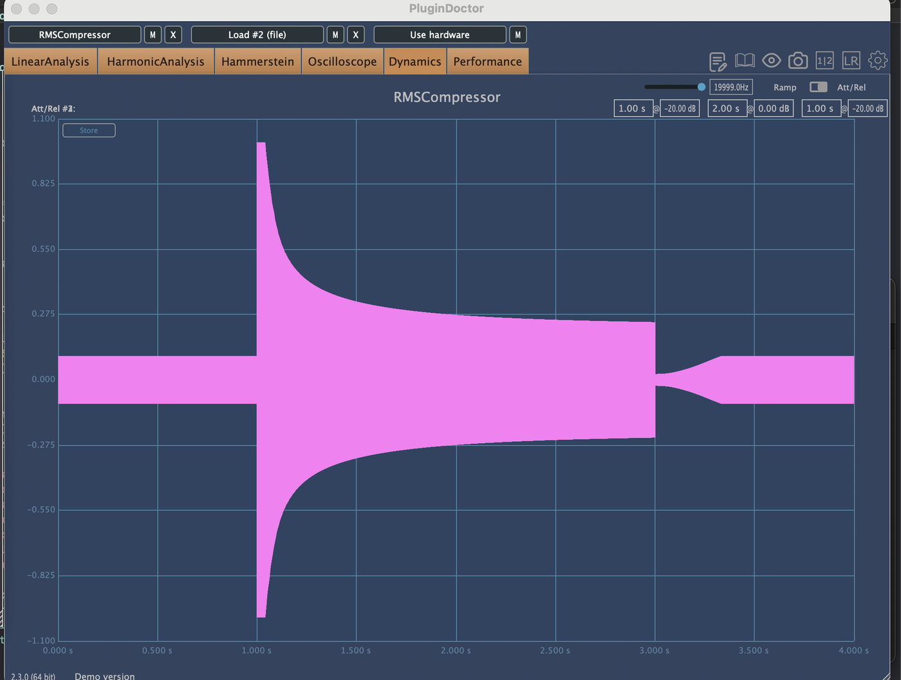

# RMSCompressor

**RMS hesaplama penceresini ve zarf eğrisinin şeklini kendiniz belirlediğiniz bir kompresör eklentisi.**

`C++` · `JUCE 7.0.12` · `AU` · `VST3` · `macOS`

*[English README →](README.md)*



---

## Nedir

Çoğu kompresör size attack ve release **süresini** verir. Ben, o sürelerin
ürettiği eğrinin **şeklini** de veren, üstelik algılayıcının karar vermeden önce
sesin ne kadarlık bir dilimini ortalayacağına da sizin karar verdiğiniz bir
kompresör istedim.

Bu ikisi normalde DSP kodunun içine gömülü sabitlerdir. Ben ikisini de çıkarıp
ön panele koydum.

Eklentiyi, İstanbul Teknik Üniversitesi'nde bir lisans dersi projesi olarak
sıfırdan C++ ve JUCE ile yazdım (bkz. [Proje bağlamı](#proje-bağlamı)).
Aşağıdaki iki fikri hayata geçirmek için JUCE'un iki DSP sınıfını
(`juce::dsp::Compressor` ve `juce::dsp::BallisticsFilter`) yamaladım; yamalı
modüller bu depoda `modules/` altında duruyor.

---

## İki fikir

### 1. Kendiniz ayarladığınız RMS hesaplama penceresi

JUCE'un `AudioBuffer::getRMSLevel()` metodu, host'un size verdiği buffer
üzerinden ortalama alır: 128 sample, 512, 1024, DAW ne ayarlıysa o. Bu sizin
kontrolünüzde değildir ve kullanıcı buffer boyutunu değiştirdiği anda o da
değişir.

Algılayıcıyı host'tan koparmak için gelen sample'ları kilitsiz (lock-free) bir
FIFO halka tamponuna yazıyorum (`Source/Fifo.h`) ve RMS'i, bu halkadan geri
çektiğim istediğim uzunlukta bir dilim üzerinden hesaplıyorum. Dilimin uzunluğunu
**RMS Period** slider'ı belirliyor, 1 ile 1500 ms arasında.



Pencere uzunluğu, algılayıcının "ne kadarını gördüğünü", dolayısıyla kompresörün
ne kadar agresif hissettirdiğini değiştiriyor. Bunu PluginDoctor ile ölçtüm;
kaynak, threshold ve ratio her iki ölçümde de aynı:

| RMS Period = 100 ms | RMS Period = 1000 ms |
|---|---|
|  |  |

Kısa pencere sinyali yakından takip ediyor, bu yüzden gain reduction çok
salınıyor ve sıkıştırma agresif duyuluyor. Uzun pencere materyalin genelini
ortalıyor, gain reduction daha sabit kalıyor ve etki yumuşayıp seviye dengeleyici
bir karaktere dönüyor.

Slider'ın üst sınırını 1500 ms yaptım, çünkü kendi denemelerimde bunun ötesindeki
pencerelerin dinamik üzerinde duyulur bir farkı kalmıyordu.

**Enable smoothing** seçeneği, bu tasarımın bir yan etkisini gideriyor. RMS'i
blok başına bir kez hesapladığım için algılayıcı sürekli bir değer değil,
basamaklı bir dizi görüyor; basamaklar arasındaki büyük sıçramalar da zarfı
istediğimden sert yapıyor. Seçeneği açtığınızda ardışık RMS değerleri arasında
`juce::LinearSmoothedValue` ile geçiş yapıyorum. Fark en net biçimde, sinyalin
3. saniyede düşmesinden sonraki release kuyruğunda görünüyor: smoothing kapalıyken
bir saniyeden çok kısa sürede toparlanıyor, açıkken kalan saniyenin tamamına
yayılarak yumuşakça çıkıyor:

| Smoothing kapalı | Smoothing açık |
|---|---|
|  |  |

### 2. Şeklini değiştirebildiğiniz zarf eğrisi

Standart JUCE'de olmayan kısım bu, ve projede en sevdiğim şey.

Balistik filtre tek kutuplu (one-pole) bir yumuşatıcı. Her sample'da zarfı, `cte`
katsayısı kadar mevcut seviyeye doğru hareket ettiriyor:

```cpp
result = level + cte * (yold - level);
cte    = std::exp (expFactor / timeMs);
```

Standart JUCE'de `expFactor` koda gömülüdür:

```cpp
expFactor = -2.0 * pi * 1000.0 / sampleRate;   // -2.0'a dokunamazsınız
```

Ben attack ve release'in her birine kendi çarpanını verdim ve ikisini de birer
parametre olarak dışarı açtım:

```cpp
expFactorAttack  = attackCo  * pi * 1000.0 / sampleRate;   // -5.0 … -0.01
expFactorRelease = releaseCo * pi * 1000.0 / sampleRate;
```

Bunun kazandırdığı şey şu: **aynı attack süresine ayarlanmış iki kompresör,
sinyali tamamen farklı tutabiliyor.** Aşağıdaki iki ölçümde de Attack'i 300 ms,
RMS Period'u 100 ms yaptım. Sadece katsayı değişiyor:

| Attack Coefficient = −0.1 | Attack Coefficient = −5.0 |
|---|---|
|  |  |

−0.1'de zarf iki saniye sonra hâlâ oturmaya devam ediyor; gain reduction'a uzun
ve yavaş bir yaslanma. −5.0'da ise anında iniyor ve 300 ms içinde işini bitirmiş
oluyor. Diğer bütün ayarlar aynı yerde.

Aynı kontrol release için de var:

| Release Coefficient = −1.0 | Release Coefficient = −5.0 |
|---|---|
|  |  |

Katsayı sıfıra yaklaştıkça cevap yavaşlıyor ve yumuşuyor; sıfırdan uzaklaştıkça
hızlanıyor ve sertleşiyor.

Bunu tesadüfen buldum. JUCE'un attack ve release'i en baştan nasıl hesapladığını
anlamak için katsayılarla oynuyordum. Değiştirdiğimde ne olduğunu duyunca,
kontrolü kullanıcıya vermek bariz seçenek hâline geldi.

---

## Sinyal akışı

```
DAW buffer
   │
   ├──▶ Fifo.h ──────────▶ N sample çek (N = RMS Period × sample rate)
   │    (kilitsiz halka)        │
   │                            ▼
   │                    kanal başına getRMSLevel()
   │                            │
   │                   opsiyonel LinearSmoothedValue  ← "Enable smoothing"
   │                            │
   │                            ▼
   └──────────────────▶ juce::dsp::Compressor (yamalı)
                                │
                        BallisticsFilter (yamalı)
                        ├─ RMS modu  → zarf, pencerelenmiş RMS'i takip eder
                        └─ Peak modu → zarf, |sample| değerini takip eder
                                │
                    attack/release katsayıları eğriyi şekillendirir
                                │
                        zarf vs. threshold → gain reduction
                                │
                        × make-up gain ──────▶ çıkış
                                │
                     gain reduction (dB) ──▶ arayüz metresi, 24 Hz timer
```

Gain reduction metresi, özel yazdığım bir `juce::Component`
(`Source/GainReductionMeter.h`). Başta klasik bir VU metre çiziyordum, sonra bu
göstergelerin arabaların hız göstergesinden çok da uzak olmadığını fark ettim.
Ben de bir hız göstergesi çizdim ve "daha hızlı"yı "daha çok gain reduction"a
denk getirdim.

---

## Parametreler

| Kontrol | Aralık | Varsayılan |
|---|---|---|
| Threshold | −60 … 0 dB | −20 dB |
| Ratio | 1, 2, 3 … 10, 15, 20, 50, 100 | 5.0 |
| Attack | 0.5 … 300 ms | 15 ms |
| Release | 5 … 1000 ms | 50 ms |
| **Attack Coefficient** | −5.0 … −0.01 | −0.1 |
| **Release Coefficient** | −5.0 … −0.01 | −0.4 |
| Make Up | −20 … +20 dB | 0 dB |
| **RMS Period** | 1 … 1500 ms | 50 ms |
| Algılama | RMS / Peak | RMS |
| Enable Smoothing | açık / kapalı | kapalı |
| Bypass | açık / kapalı | kapalı |

Bütün parametreler otomasyona uygun. Üst kısımda ayrıca kanal başına **Max RMS**
(yaklaşık son 4 saniyedeki en yüksek RMS) ve **Current RMS** görünüyor, saniyede
24 kez yenileniyor.

Make-up gain JUCE'un kompresör sınıfında yok, o yüzden onu ben yazıp çıkış
katına ekledim.

**Peak**'i seçtiğinizde RMS Period'un bir etkisi kalmıyor, çünkü algılayıcı doğrudan
sample'ın genliğini okuyor.

Eklentiyi Logic Pro, Ableton Live ve Reaper'da denedim.

---

## Derleme

macOS ve Xcode gerekiyor. Proje **JUCE 7.0.12** hedefliyor ve yamalı modüller
`modules/` içinde depoda duruyor; yani DSP'yi derlemek için ayrıca JUCE kurmanıza
gerek yok.

Bilmeniz gereken tek pürüz şu: bu depodaki `JuceLibraryCode/` bir **JUCE 8**
Projucer'ından çıktı, `modules/` ise JUCE 7. Bu yüzden JUCE 8'e ait iki derleme
biriminin hariç tutulması gerekiyor. Aşağıdaki komut AU hedefinde çalışıyor;
`BUILD SUCCEEDED` veriyor ve `auval` geçiyor:

```bash
cd Builds/MacOSX
xcodebuild -project RMSCompressor.xcodeproj \
  -target "RMSCompressor - AU" -configuration Release \
  EXCLUDED_SOURCE_FILE_NAMES="include_juce_graphics_Harfbuzz.cpp include_juce_core_CompilationTime.cpp" \
  HEADER_SEARCH_PATHS="\$(SRCROOT)/../../JuceLibraryCode \$(SRCROOT)/../../modules \$(SRCROOT)/../../modules/juce_audio_plugin_client/AU \$(SRCROOT)/../../modules/juce_audio_processors/format_types/VST3_SDK" \
  build
```

VST3 için hedefi `"RMSCompressor - VST3"` olarak değiştirin.

Xcode'un eklenti kopyalama adımı, her Release derlemesinde çıktıyı
`~/Library/Audio/Plug-Ins/Components/` altına kuruyor; yeni sürümü görmesi için
DAW'ı kapatıp açın.

> Projeyi bir JUCE 7 Projucer'ıyla yeniden üretmek ya da yamalarımı JUCE 8'e
> taşımak, bu bayraklara olan ihtiyacı ortadan kaldırır. Aşağıdaki listede duruyor.

---

## Depo yapısı

| Yol | Ne olduğu |
|---|---|
| `Source/PluginProcessor.*` | Parametreler, RMS hesabı, sinyal akışı |
| `Source/PluginEditor.*` | Arayüz, 24 Hz yenileme timer'ı |
| `Source/Fifo.h` | Hesaplama penceresi için kilitsiz halka tamponu |
| `Source/GainReductionMeter.h` | Özel yazdığım analog tarzı iğneli metre |
| `modules/juce_dsp/widgets/juce_Compressor.*` | **Yamalı.** RMS algılama yolunu, make-up gain'i ve bypass'ı ekledim |
| `modules/juce_dsp/processors/juce_BallisticsFilter.*` | **Yamalı.** Zarf katsayılarını dışarı açtım |
| `docs/` | Bu README'de kullandığım ekran görüntüleri ve ölçümler |

### Dallar

| Dal | Amacı |
|---|---|
| `au-release` | **Varsayılan.** Çalışan hat: yamalı modüller, derleniyor ve `auval` geçiyor |
| `main` | Arşiv. Üçüncü bir algılama modu eklemeye çalışıp yarıda bıraktığım bir deneme; DSP tarafını kaybettim, o yüzden derlenmiyor |
| `arsiv-2024-nisan` | Arşiv. JUCE DSP modüllerini yamalamadan önceki, Nisan 2024 tarihli erken bir anlık görüntü |

---

## Bilinen eksikler

Dürüst bir liste. Bu kodu C++ öğrenirken yazdım; Ağustos 2026'da geri dönüp
baştan sona düzgünce inceleyince düzeltilmeye değer şeyler buldum. Düzelttikçe
buradaki maddeleri işaretliyorum.

### Hâlâ açık

- [ ] **Gain reduction değerinde veri yarışı.** Düz bir `float`; audio
      thread'den yazılıp arayüz thread'inden okunuyor. RMS tamponuna da iki
      yerden yazılıyor, bu da FIFO'nun tek-yazar sözleşmesini bozuyor.
- [ ] **Balistik filtrede varsayılan dönüş değeri yok.** Ne peak ne rms
      seçiliyken `processSample` değer döndürmeden fonksiyonun sonuna varıyor.
- [ ] **Gain reduction metresi kalibre değil.** Ölçek işaretlerini eşit açı
      aralıklarıyla çiziyorum, ama temsil ettikleri değerler doğrusal değil;
      dolayısıyla iğne, uçlar dışında etiketlerle uyuşmuyor.
- [ ] **`modules/` ile `JuceLibraryCode/` arasında JUCE 7 / JUCE 8
      uyumsuzluğu**; yukarıdaki derleme bayrakları bu yüzden var.
- [ ] `processBlock` içinde isim gölgeleme ve `resized()` içinden `setSize()`
      çağrısı.

### Düzeltilenler

- [x] **Audio thread'de her sample için heap tahsisi.** `processSample`,
      `std::vector<float> rmsLevels`'ı sample döngüsünün içinde değer olarak
      alıyordu; kanal başına saniyede yaklaşık 44.100 tahsis demekti. Artık
      `const&` ile geçiyor.
- [x] **Ratio, değeri yerine indeksiyle başlatılıyordu.** `prepareToPlay`,
      seçim listesinin indeksini doğrudan `setRatio()`'ya veriyordu; ratio 1.0
      ile kaydedilmiş bir oturum açıldığında `setRatio(0)` çağrılıyor ve sıfıra
      bölme oluyordu. İki çağrı yeri de artık sınır denetimli
      `ratioFromIndex()` üzerinden geçiyor.
- [x] **Mono'da sınır dışı okuma.** Arayüz koşulsuz olarak 1 numaralı kanalı
      okuyordu, oysa `isBusesLayoutSupported` mono'ya izin veriyor. Artık
      processor'a kaç kanalın güvenle sorgulanabileceğini soruyor ve mono'da
      sol kanala düşüyor.
- [x] **`prepareToPlay` bütün parametreleri aktarmıyordu.** Attack, release,
      make-up gain, bypass, algılama modu ve iki zarf katsayısı yalnızca bir
      sonraki parametre değişiminde DSP'ye ulaşıyordu; oturum yüklendikten
      sonraki ilk bloklar eski değerlerle işlenebiliyordu. Hepsi artık
      prepare sırasında aktarılıyor.

Tam olarak çözemediğim bir şey daha var: RMS penceresini çok kısa tutup attack'i
de çok düşürdüğünüzde attack eğrisi düzgün bir eğri olmaktan çıkıyor. Uzun süre
canımı sıktı, sonra bu bozulmanın kendi başına bir efekt olarak kullanılabileceğine
karar verip öyle bıraktım.

---

## Proje bağlamı

Bunu **İstanbul Teknik Üniversitesi** Müzik Teknolojileri bölümünde, 2024
baharında **Serbest Proje Çalışması 2** dersi için yaptım ve 7 Haziran 2024'te
teslim ettim. Danışmanım **Dr. Ozan Sarıer**'di; değiştirilebilir pencere fikri
de onun önerisinden çıktı.

Döneme neredeyse hiç programlama bilgisi olmadan başladım: biraz JavaScript
vardı, C++ ise hiç yoktu. Dili öğrenmekle kompresörü yazmayı tek dönem içinde
paralel götürdüm.

Ayrıca 29 sayfalık bir proje raporu yazdım: DSP arka planını, geliştirme
sürecini, yol boyunca karşılaştığım problemleri ve PluginDoctor ölçümlerini
kapsıyor. Bu depoda yok; isterseniz bana yazın, ileteyim.

### Teşekkür

**Akash Murthy.** Kendisine hiç tanımadan bir e-posta attım; bir saatini ayırıp
benimle Zoom görüşmesi yaptı ve FIFO halka tamponunun, RMS algılamayı host buffer
boyutundan nasıl bağımsızlaştırabileceğini anlattı. O görüşme projenin en kritik
problemini açtı. Dünyanın öbür ucundaki bir ses mühendisiyle öylece konuşabileceğim
de aklıma gelmemişti; bu, teknik cevabın kendisi kadar değerli çıktı.

**Dr. Ozan Sarıer**, projenin fikri ve danışmanlığı için.

---

## Lisans

Bu depo, JUCE 7 modüllerinin değiştirilmiş kopyalarını içeriyor ve bunları
JUCE'un GPLv3 seçeneği kapsamında kullanıyorum (JUCE splash screen açık).
Dolayısıyla her türlü dağıtım **GPLv3** kapsamına giriyor.
